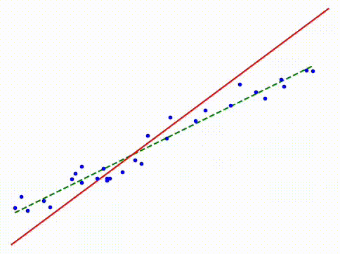

# ft_linear_regression

This project implements simple linear regression from scratch using gradient descent to find the optimum.

  

## Programs

1. **Ft_linear_regression.py**: 
   - Reads a dataset from a CSV file (passed as an argument)
   - Assumes the dataset has 2 columns: target variable (1st) and independent variable (2nd)
   - Trains the linear regression model on the provided data
   - Saves the line values in a `results.txt` file
   - Generates plots of the regression and loss function

2. **predict.py**:
   - Takes a number as input
   - Predicts a value based on the previous training

3. **precision.py**:
   - Calculates and returns the Mean Squared Error (MSE) of the regression

4. **fancy_visualization**:
   - Demonstrates how the regression line fits a dataset step by step in an animation

## Simple Linear Regression

Simple linear regression aims to find a linear relationship between an independent variable (x) and a dependent variable (y). The relationship is modeled as:

y = mx + b

Where:
- y is the predicted value
- x is the independent variable
- m is the slope of the line
- b is the y-intercept

The goal is to find the best values for m and b that minimize the difference between predicted and actual y values.

### Gradient Descent

Gradient descent is an optimization algorithm used to find the values of m and b that minimize the cost function. The steps are:

1. Initialize m and b with random values
2. Calculate the predicted y values: y_pred = mx + b
3. Compute the cost (Mean Squared Error):
   MSE = (1/n) * Σ(y_pred - y_actual)²
4. Calculate the gradients:
   - dm = (2/n) * Σ((y_pred - y_actual) * x)
   - db = (2/n) * Σ(y_pred - y_actual)
5. Update m and b:
   - m = m - learning_rate * dm
   - b = b - learning_rate * db
6. Repeat steps 2-5 until convergence or for a fixed number of iterations

The learning rate in this program is fixed to 0.05 and an automatic stopping is implemented when the optimum is reached.
